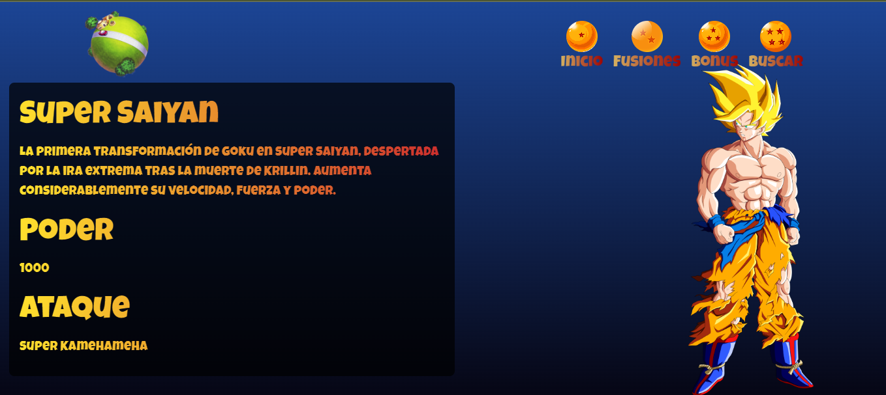

  # Dragon Ball Z Frontend
Este proyecto es una aplicación frontend desarrollada en Vue.js que interactúa con una API REST de Dragon Ball Z. La aplicación permite visualizar datos sobre personajes y versiones de Dragon Ball Z, incluyendo atributos como el ataque.

## Tabla de Contenidos

- [Descripción](#descripción)
- [Capturas de Pantalla](#capturas-de-pantalla)
- [Instalación](#instalación)
- [Licencia](#licencia)
- [Contacto](#contacto)

## Descripción
La aplicación Frontend de Dragon Ball Z está diseñada para proporcionar una interfaz atractiva, responsiva y funcional para gestionar personajes y sus respectivas versiones. Los usuarios pueden consultar los detalles de los personajes, ver sus atributos y explorar sus diferentes versiones. La aplicación consume una API REST personalizada para obtener los datos.

### Tecnologías utilizadas:

- **Lenguaje:** JavaScript
- **Framework:** Vue.js
- **Estado de gestión:** Vuex
- **Navegación:** Vue Router
- **Consumo de API:** Axios para realizar solicitudes HTTP a la API
- **Bootstrap:** Para un diseño responsivo

### Características:

- Interfaz amigable para la visualización de personajes.
- Consumo de datos desde mi propia API de Dragon Ball Z.
- Navegación fluida entre diferentes vistas.
- Full Responsiva


## Capturas de Pantalla





## Instalación

Sigue estos pasos para instalar el proyecto localmente:

1. Clona el repositorio:
   ```bash
   git clone https://github.com/McKingston01/front-api-dbz.git

2. Project setup
    ```
    npm install
    ```

3. Compiles and hot-reloads for development
    ```
    npm run serve
    ```

4. Compiles and minifies for production
    ```
    npm run build
    ```

## Licencia
Este proyecto no tiene una licencia formal. Puedes usar y modificar el código para proyectos personales o educativos. Para otros usos, por favor contactar.

## Contacto
- LinkedIn: [https://www.linkedin.com/in/mcsadevp/](https://www.linkedin.com/in/mcsadevp/)
- Email: mc.sa.kingston@gmail.com

## By McKingston


